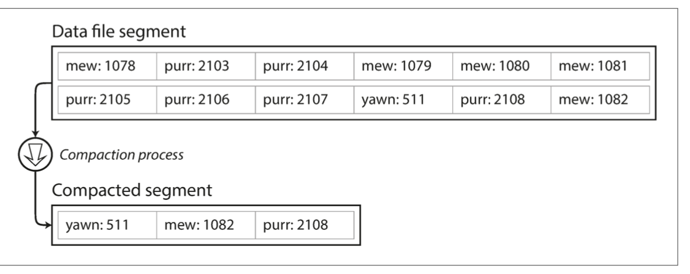

# Storage and Retrieval

* In database there are two main things you give the data -> it store the data and when asked later it give the data back to you.
* In data models and query languages we show how an developer give and query data.
* In this we will see how in database data is stored and how can we query -> basically indexes 
* To choose the best suited storage engine for application and to tune it for workload. 
* Diff in transactional storage vs analytics .
* We will raad about 2 types of storage engine Relational vs No-SQL or Log-Structured storage engines vs page-oriented storage engines such as B-trees.
* Let's say we have a db_set function which is append only function it sets key , value pair.
  * It doesn't overwrite but append like append only data files -> logs. Many database are based on that. So to read the latest we see the last i.e. tail. It's easy and fast.
  * In real databases there will be issues: concurrency issue, reclaiming disk space to prevent logs from growing forever. Error handling and partially written records.
* In case of db_get operation based on append only log it will be O(N) -> N number of document for each fetch call.
  * To solve this we use index-> it's contain metadata that help to locate main data. But this will increase write time.
  * Any change in data will mean we also need to update index.
  * Well-chosen indexes speed up read query, but always slow down write . 
    * Developer need to choose indexes manually using query patterns without much overhead on write.

## Hash Indexes
* Indexes for key value data. Uses as hashmap for in memory storage.
* Let's use to store data on disk.
* Let's say we have append only file. We have index in form of key-value -> containing key & offset of location where value exist in log file. 
  * In case of any insertion or update of data offset will change
  * For look up use hashmap
* Hash index is used in **Bitcask** which is used in **RIAK** distributed database.
  * In this entire key value system is placed in memory. 
  * Data can use more space than available in memory.
  * We can access data with single seek or from the cache also.
  * Used in URL hit count, in messaging queues since it's append only, in event logging(keys are id & timestamp).
  * **Session stores** - temp storage data -> authentication token, shopping carts & login states. It's used in some small microservices locally.
  * We can do **segmentation** store data in different file to prevent out of memory issue. 
  *  -> to remove duplicate logs & keeping recent update for each key
  * When we do compaction segments become small, so they can be merged. Merger can happen in background and it's a new file meanwhile we read from old segments.
  * Each segment has its own in-memory hash table, to fetch a value we start from visiting the recent hashtable. Due to merger there are less number of hashtable.
  * **File format** for log file
    * Usually we use binary format in which we  store data in form of length and raw string. Length is needed to decide on spacing.
    * Using csv is complicated it will require to handle escape character , and new line . 
      * Also csv processing is slow needs more time.
  * **Delete record** : for that we add tombstone record so that when files are merged we delete the key present in tombstone record.
  * **Crash recovery** : In memory hashmap need to be rebuilt again by reading data or bitcask store snapshot in disk.
  * **Partial records**: Bitcask check this using checksums to figure out corrupt records due to crashing of database.
  * **Concurrency control**: Usually write is single threaded but read can be multithreaded considering segments are appendable but immutable.
    * Someone might say why not update file overwriting old values. But appending is much faster.
  * With append only file it's helpful in crash recovery & concurrency control. If crash occurs old data is safe it's only end of data which is affected. 
    * In case of concurrency it will be never like we are reading mid-way and write happens
  * At times, we have old data and with append only it becomes fragmented data here and there. When we merge it removes old and unused data.

### Limitations

* Hash table grow in size it's not possible to hold all the keys in memory. 
  * But keeping hashmap in disk is not possible it become expensive to do rehashing and grow size.
  * Handling collision is difficult, it requires random access.
* Range queries are expensive we will have to look for each key.

## SSTables & LSM Trees

* SST -> String sorted table. we store data in key value pair , but it's sorted by keys.
* We ensure each key occur once compaction ensure that.
* Merging segment is done using merge sort. If a key is in multiple segment . Then the recent segment have recent key
* We create a sparse index , that means offset/ location of some keys.
* When a key comes like handbag we do binary search or find floor in treemap to find nearest and the do forward search.
  * We still in-memory table 1 key for few kb of data 
* Since read request anyway have to search the range we can store data in compressed form. Each entry of sparse table point to start of compressed data.
  * Compression save disk space

### Constructing and maintaining SST table

* We can use red-black or AVL tree to store data in sorted order. With this we insert in any order and read in sorted order.
  * When write comes write in form of in-memory balanced tree -> memetable
  * When memetable is bigger than threshold write in SST table data will be sorted. Recent segment will have recent data do compaction merge segments.
  * Writes can be done in memetable . Reads find key in memetable then in recent disk then next.
  * What will happen if database crashe to memetable data for that we can have seperate log file where we append recent data for recovery in any order.

### LSM Tree out of SST table

* It is used in LevelDB & RocksDB 